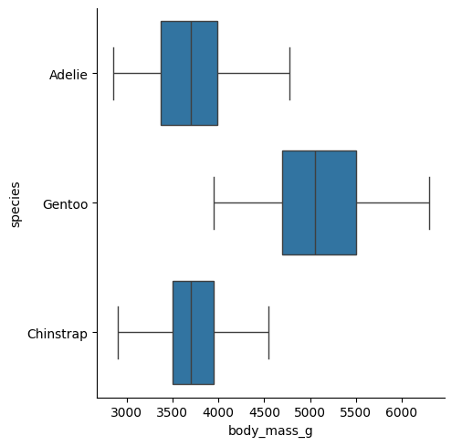
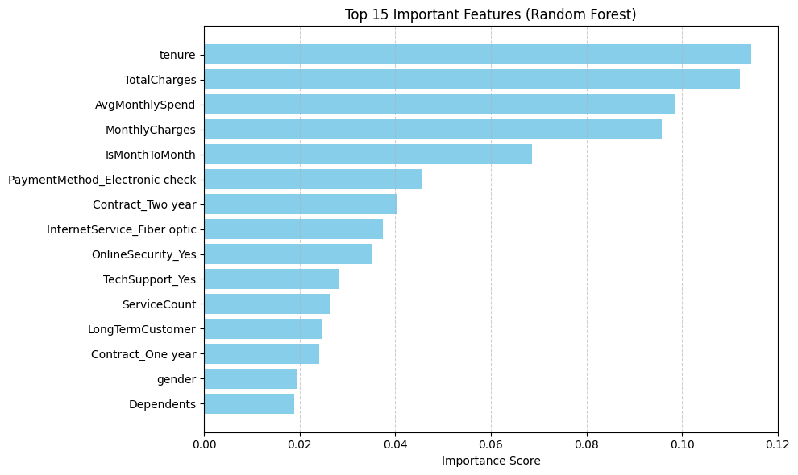
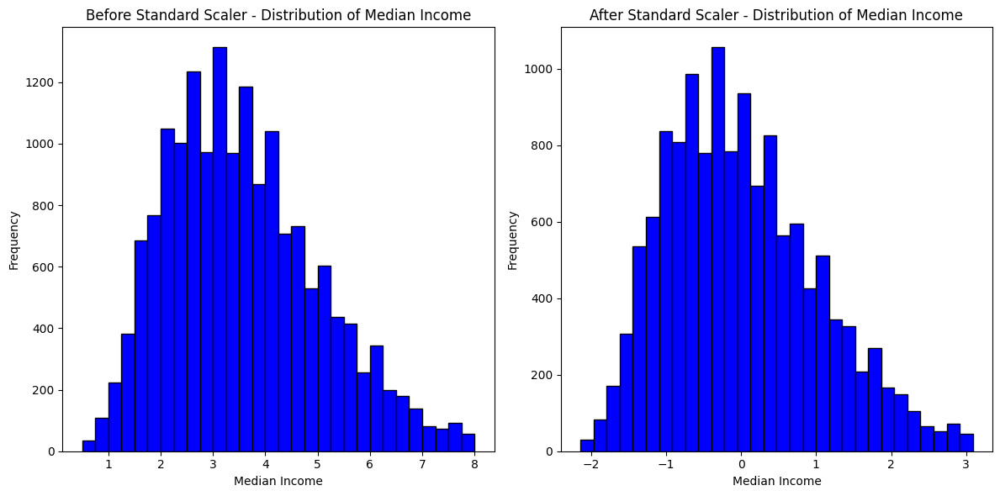

# AIBootcampRepo
This repository contains mini projects developed during the AI Bootcamp.

# 🧠 AI Bootcamp Mini Projects

This repository contains mini projects completed during the AI Bootcamp, focusing on EDA, classification, regression, and model interpretation using SHAP/LIME.

---

## 📚 Project List

### 1. 🐧 Penguins EDA

Exploratory analysis on the Palmer Penguins dataset.

- Outlier detection using IQR  
- Distribution plots by species  
- Correlation heatmap  
- Species-level body mass comparison

📁 Folder: `01_penguins_eda/`  
▶️ [View Notebook](PalmerPenguinsEDA/PalmersPenguinsEDA.ipynb)

#### 📷 Sample Output:

---

### 2. 📉 Churn Analysis

Binary classification to predict customer churn.

- Data preprocessing  
- Feature engineering & encoding  
- LightGBM & RandomForest classifiers  
- Precision, Recall, ROC-AUC, F1-score

📁 Folder: `02_churn_analysis/`  
▶️ [View Notebook](TelcoCustomerChurn/TelcoCustomerChurn.ipynb)

#### 📷 Sample Output (Churn Feature Importance):

---

### 3. 🏠 House Price Prediction

Regression model to predict housing prices.

- Ridge / Lasso comparison  
- RMSE evaluation  
- Feature importance ranking

📁 Folder: `03_house_price/`  
▶️ [View Notebook](CaliforniaHousePrices/HausePriceDataModels.ipynb)

#### 📷 Sample Output:

---

## 🔧 Tech Stack

- Python 3.11  
- pandas, seaborn, matplotlib  
- scikit-learn, lightgbm, xgboost  
- SHAP, LIME

---

## 📌 Note

Each notebook is self-contained and includes markdown explanations, visualizations, and clean code.  
These projects reflect my learning journey through the bootcamp.

---

## 📬 Contact

Feel free to connect on [https://linkedin.com](https://www.linkedin.com/in/muratcagriozkan/)    or open an issue in this repo.
